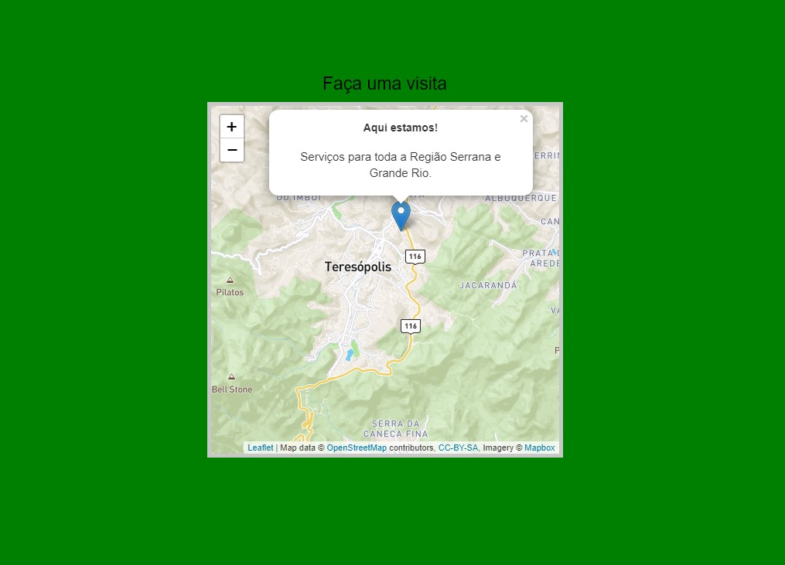

<!-- ABOUT THE PROJECT -->

## About The Project

    </i>

 
This project is a practice using leaflet.js API for mapping geolocation.

© OpenStreetMap contributors;
© Mapbox;

### Built With

- [HTML]
- [CSS]
- [JavaScript]

<!-- CONTACT -->

## Contact

Salomão A. S. Nunes - [@salonunes](https://instagram.com/salonunes/) - contato@salomaonunes.com.br

Project Link: [https://github.com/salomaonunes/portfolio_salomao](https://github.com/salomaonunes/mapa_teste_leaflet.js)
